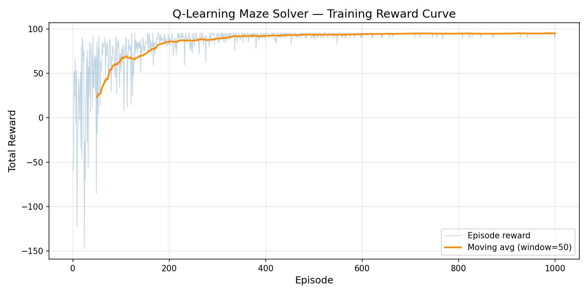
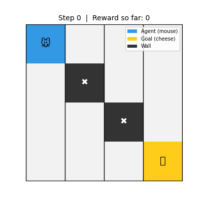

# PyTorch ML Portfolio

From-scratch implementations of core ML systems in PyTorch, covering reinforcement learning, NLP, and retrieval-augmented generation.

[](https://python.org)
[](https://pytorch.org)
[](https://mujoco.readthedocs.io)
[](https://opensource.org/licenses/MIT)

---

## Overview

| Project | Task | Key Result |
| :-------- | :----- | :----------- |
| [Q-Learning Maze](./01_q_learning_maze/) | Tabular RL on 4x4 grid | Optimal policy in ~300 episodes |
| [Transformer Basics](./02_transformer_basics/) | Self-attention from scratch | Custom encoder block + HuggingFace inference |
| [PPO Reacher](./03_ppo_reacher/) | 2-DOF robotic arm control | Converged policy via PPO-Clip + GAE |
| [RAG Assistant](./04rag-assistant/) | Local retrieval-augmented QA | End-to-end pipeline: ChromaDB + TinyLlama |
| [PPO Ant Walker](./05_mujoco_ant/) | Quadruped locomotion (8-DOF) | State-based: reward +632; Pixel-based (CNN encoder): reward +301 from raw images |

---

## Projects

### [1) Q-Learning Maze Solver](./01_q_learning_maze/)

Tabular Q-learning agent with epsilon-greedy exploration that learns to navigate a 4x4 grid world with walls and sparse reward. Environment sim in `01_q_learning_maze/maze_env.py`, Q-value update and policy in `q_learning_agent.py`.

| Training Curve | Agent Demo |
| :---: | :---: |
|  |  |

---

### [2) Transformer Basics (PyTorch + HF Integration)](./02_transformer_basics/)

From-scratch `SimpleSelfAttention` and `TransformerBlock` in `02_transformer_basics/transformer_block.py`, plus inference scripts using DistilBERT for sentiment (`sentiment_analysis.py`) and GPT-2 for generation (`text_generation.py`).

---

### [3) PPO Reacher Agent (MuJoCo)](./03_ppo_reacher/)

PPO-Clip + GAE training pipeline for a 2-DOF robotic arm in Reacher-v5. Separate actor/critic networks with Gaussian policy, clipped value loss, and LR annealing. Core PPO logic in `03_ppo_reacher/ppo.py`, networks in `networks.py`.

| Training Curve | Agent Demo |
| :---: | :---: |
|  |  |

---

### [4) Local RAG Assistant](./04rag-assistant/)

Full RAG stack (load, chunk, embed, retrieve, generate) using LangChain + ChromaDB + TinyLlama, all running locally without API keys. Modular pipeline across `04rag-assistant/src/step*.py`. Indexes ~20 chunks from a source document, end-to-end in ~52s.

---

### [5) PPO Ant Walker (MuJoCo)](./05_mujoco_ant/)

PPO for high-dimensional locomotion (8 actuators, 105-dim observations) on Ant-v5, implemented in two phases:

**Phase 1 — State-based PPO:** Reaches peak reward +632 after 5M steps using MLP networks, with Welford observation/reward normalization, linear LR annealing, and optional domain randomization for sim-to-real robustness.

**Phase 2 — Pixel-based PPO:** The agent observes only raw 84×84 camera images (no joint angles or velocities). A CNN encoder (Nature DQN-style) extracts visual features, combined with DrQ-style data augmentation, uint8 memory optimization, learning rate separation, and reward normalization. Achieves average reward +301 (peak +536) after 1M steps — learning to walk purely from pixels.

| | State-based (MLP) | Pixel-based (CNN) |
|---|---|---|
| Input | 105-dim state vector | 84×84 RGB × 3 frames |
| Best reward | +632 | +301 (peak episode +536) |
| Training steps | 5,000,000 | 1,000,000 |
| Training time | ~37 min | ~126 min (CPU) |
| Parameters | ~131K | ~1,025K |

| Training Curve (State-based) | Agent Demo |
| :---: | :---: |
|  |  |

---

## Quick Start

**Prerequisites:** Python 3.9+

```bash
git clone https://github.com/YOUR_USERNAME/pytorch-learning-lab.git
cd pytorch-learning-lab
pip install -r requirements.txt
```

> `torch` installation can vary by OS/CUDA. Use the selector at [pytorch.org](https://pytorch.org/get-started/locally/).

---

## Repository Layout

```text
pytorch-learning-lab/
├── 01_q_learning_maze/
│   ├── maze_env.py                # Grid world environment
│   ├── q_learning_agent.py        # Q-table agent with ε-greedy
│   ├── train.py                   # Training loop
│   └── results/                   # Reward curve + agent GIF
├── 02_transformer_basics/
│   ├── transformer_block.py       # Self-attention + encoder block
│   ├── sentiment_analysis.py      # DistilBERT inference
│   └── text_generation.py         # GPT-2 generation
├── 03_ppo_reacher/
│   ├── networks.py                # Actor-Critic networks
│   ├── ppo.py                     # PPO-Clip + GAE
│   ├── train.py                   # Training loop
│   ├── evaluate.py                # Evaluation + recording
│   └── results/                   # Reward curve + agent GIF
├── 04rag-assistant/
│   └── src/                       # Modular RAG pipeline steps
├── 05_mujoco_ant/
│   ├── networks.py                # ActorCritic (MLP) + CNNEncoder + PixelActorCritic
│   ├── ppo_agent.py               # State-based PPO agent
│   ├── ppo_buffer.py              # PPO rollout buffer with GAE
│   ├── obs_normalizer.py          # Welford running normalization
│   ├── reward_normalizer.py       # Reward variance scaling
│   ├── domain_random.py           # Sim-to-real randomization
│   ├── train.py                   # State-based training loop
│   ├── pixel_wrapper.py           # Image observation wrapper
│   ├── pixel_ppo_agent.py         # Pixel PPO agent (CNN + augmentation)
│   ├── pixel_ppo_buffer.py        # Buffer with uint8 image storage
│   ├── augmentation.py            # DrQ-style random shift
│   ├── pixel_train.py             # Pixel-based training loop
│   ├── tests/                     # Unit and integration tests
│   ├── tools/                     # Recording, plotting, exploration
│   └── results/                   # Reward curves + agent demos
├── requirements.txt
└── README.md
```

---

## References

**Reinforcement Learning**
- Sutton & Barto — [*Reinforcement Learning: An Introduction*](http://incompleteideas.net/book/the-book-2nd.html)
- Schulman et al. — [*Proximal Policy Optimization Algorithms*](https://arxiv.org/abs/1707.06347)
- Schulman et al. — [*Generalized Advantage Estimation*](https://arxiv.org/abs/1506.02438)
- Mnih et al. — [*Human-level control through deep reinforcement learning*](https://www.nature.com/articles/nature14236) (2015)
- Kostrikov et al. — [*Image Augmentation Is All You Need*](https://arxiv.org/abs/2004.13649) (2020)

**NLP & Transformers**
- Vaswani et al. — [*Attention Is All You Need*](https://arxiv.org/abs/1706.03762)

**Retrieval-Augmented Generation**
- Lewis et al. — [*Retrieval-Augmented Generation*](https://arxiv.org/abs/2005.11401)

**Documentation**
- [PyTorch](https://pytorch.org/docs/stable/index.html)
- [MuJoCo](https://mujoco.readthedocs.io/)
- [Gymnasium Ant-v5](https://gymnasium.farama.org/environments/mujoco/ant/)

---

## License

This repository is licensed under the [MIT License](https://opensource.org/licenses/MIT).
